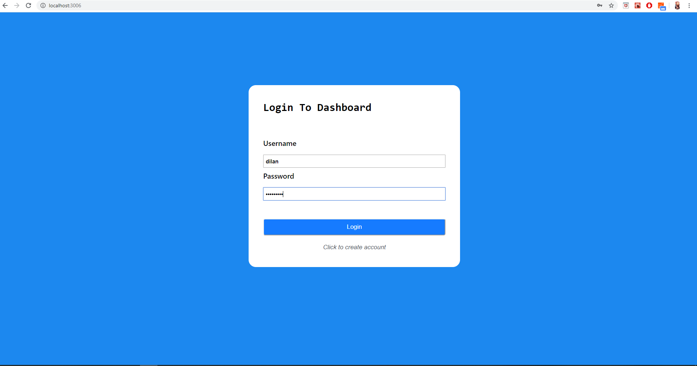
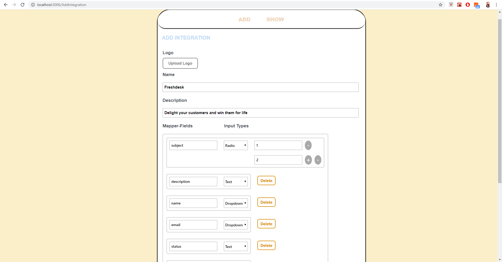
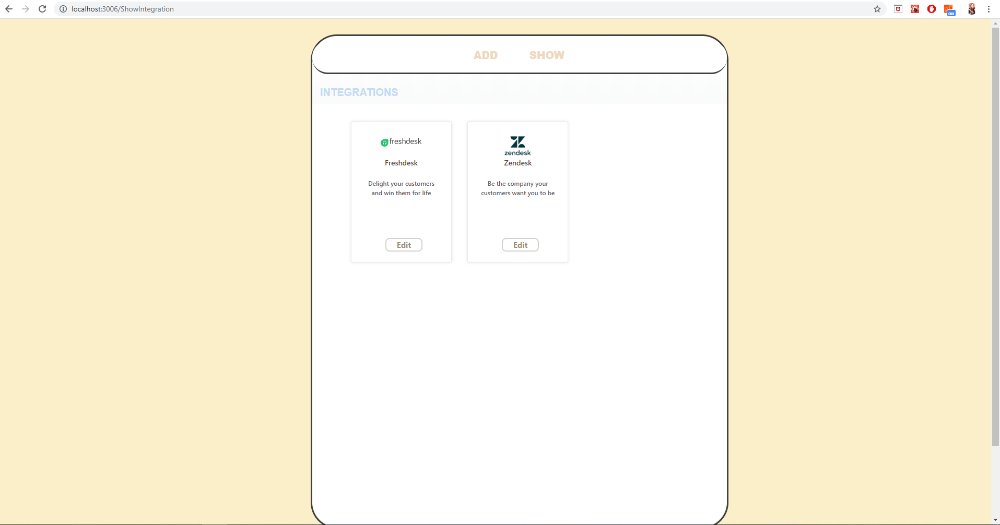
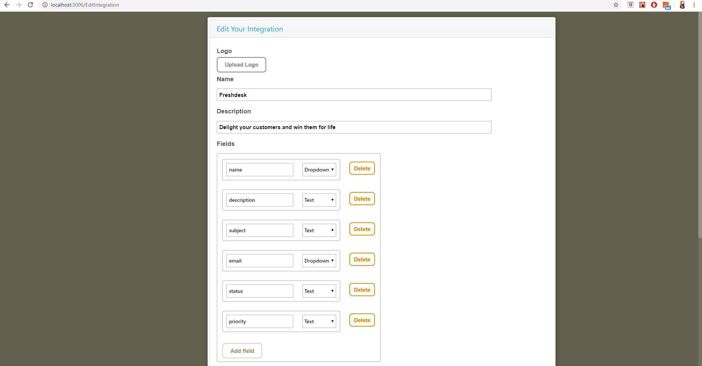

<h2>Integration Creation Panel</h2>

Admin users can add and edit integrations for jotform users. They need to determine ticket mapper and authantication mapper fields for users. If they want they can edit theese fields on this application. 

<h3>Usage</h3>

<h4>1.Login with your created account</h4>

<h4>2.User directed to add integration component to create integration. User should write mapper fields and authantication fields which integration expect to create ticket.</h4>

<h4>3.When user clicks to show, directed to show integrations component to see integrations. </h4>

<h4>4.Users can click to edit button if he wants to edit,delete or add any integration field</h4>

